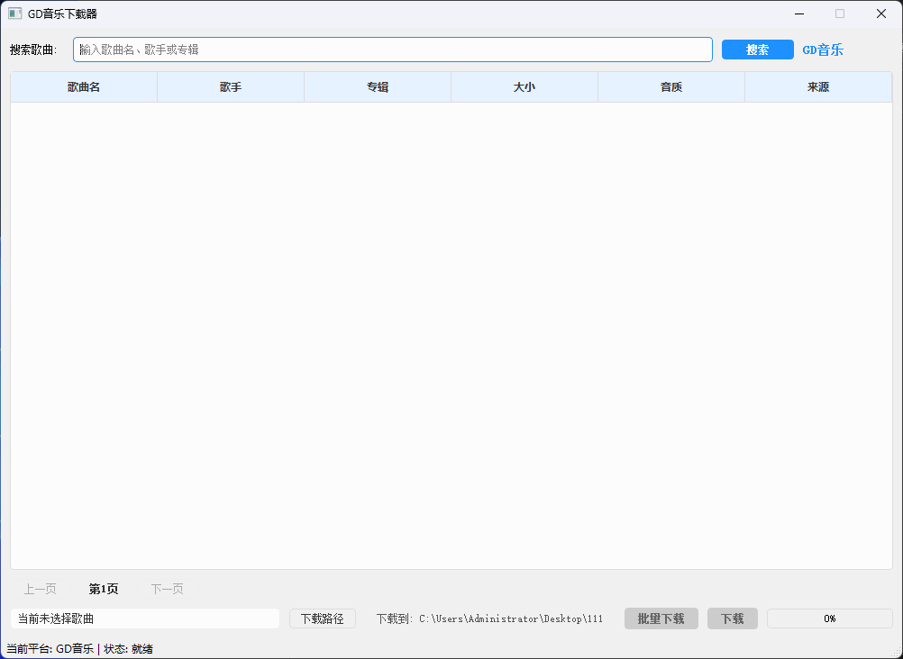

# 音乐下载器 (Music Downloader)

[](LICENSE)
[](https://www.python.org/)
[](https://pypi.org/project/PyQt5/)
[](https://github.com/layne-source/music-downloader/releases)

一个简洁高效的音乐下载工具，支持网易云音乐源搜索和下载高品质音乐。

> An elegant and efficient music download tool supporting NetEase Cloud Music API for searching and downloading high-quality music.

## 🎵 功能演示



*功能演示截图 (待添加)*

## ✨ 最新版本更新 (v1.2.0)

- **📁 优化下载路径**: 现在默认下载到桌面的Music文件夹，更加方便查找
- **🎵 格式优化**: 限制只下载MP3格式（最高320K），避免下载过大的FLAC文件
- **💻 界面优化**: 移除命令行窗口，提供纯净的界面体验
- **⚡ 效率提升**: 优化下载流程和文件大小检测机制
- **🛡️ 稳定性增强**: 提高下载链接获取成功率，改进错误处理

## 🚀 功能特点

- 基于优质音乐API，默认使用网易云音乐数据源
- 强大的搜索功能，支持按歌曲名称或歌手名搜索
- 分页显示搜索结果，提供便捷的翻页功能
- 详细的搜索结果信息，包括歌曲名称、歌手、大小和音质
- 支持下载高品质音乐（最高320Kbps）
- 实时显示下载进度，提供直观的用户体验
- 支持批量下载多首歌曲，提高效率
- 可自定义下载路径，满足个性化需求

## 📥 下载和安装

### 方法一：直接使用可执行文件（推荐）

1. 从[Releases页面](https://github.com/layne-source/music-downloader/releases)下载最新版本
2. 解压缩下载的ZIP文件到任意位置
3. 双击运行`音乐下载器.exe`
4. 无需安装Python或任何依赖库，开箱即用

### 方法二：从源代码运行

如果您希望从源代码运行程序，请按照以下步骤操作：

```bash
# 克隆仓库
git clone https://github.com/layne-source/music-downloader.git
cd music-downloader

# 安装依赖
pip install -r requirements.txt

# 运行程序
python main.py
```

## 📖 使用指南

1. 在搜索框中输入歌曲名称或歌手名
2. 点击"搜索"按钮或按Enter键进行搜索
3. 在搜索结果列表中单击选择需要下载的歌曲
4. 点击"下载路径"按钮可以自定义文件保存位置
5. 点击"下载"按钮开始下载所选歌曲
6. 如需批量下载，可按住Ctrl键选择多首歌曲，然后点击"批量下载"按钮
7. 下载完成后，音乐文件将保存在指定目录（默认为桌面的Music文件夹）

## 🏗️ 项目结构

```
├── main.py                # 主程序入口
├── build.py               # 自动构建脚本
├── requirements.txt       # 依赖库列表
├── screenshots/           # 截图目录（用于README）
├── src/                   # 源代码目录
│   ├── api/               # API接口模块
│   │   ├── api_factory.py # API工厂类
│   │   ├── base_api.py    # 基础API抽象类
│   │   ├── netease_api.py # 网易云音乐API实现
│   │   └── gdmusic_api.py # GD音乐API实现
│   ├── ui/                # 用户界面模块
│   │   ├── main_window.py # 主窗口实现
│   │   └── threads.py     # 下载和搜索线程
│   └── utils/             # 工具类模块
│       └── tools.py       # 通用工具函数
└── README.md              # 项目说明文档
```

## 🔨 构建可执行文件

本项目提供了简便的构建脚本，您可以轻松创建独立的可执行文件：

```bash
# 使用内置构建脚本
python build.py

# 或者使用PyInstaller手动构建
pyinstaller --onedir --noconsole --icon=src/icons/icon.ico --name "音乐下载器" main.py
```

构建完成后，在`dist/音乐下载器`目录中找到生成的可执行文件和相关依赖。同时，`dist`目录下会自动生成`音乐下载器.zip`文件，可直接用于分发。

## ❓ 常见问题

<details>
<summary><b>程序无法启动</b></summary>
<p>确保系统已安装Visual C++ Redistributable 2015-2022。微软官方下载地址：<a href="https://aka.ms/vs/17/release/vc_redist.x64.exe">Visual C++ Redistributable</a></p>
</details>

<details>
<summary><b>搜索结果为空</b></summary>
<p>尝试使用更简单的关键词，或检查网络连接。某些特殊字符可能会影响搜索结果。</p>
</details>

<details>
<summary><b>下载失败</b></summary>
<p>检查网络连接，或尝试搜索其他版本的歌曲。某些音乐可能因版权问题无法下载。</p>
</details>

<details>
<summary><b>使用Python 3.13构建时遇到问题</b></summary>
<p>确保添加了正确的hidden-import参数，特别是PyQt5相关的模块。建议查看build.py了解详细配置。</p>
</details>

## 💻 系统要求

- **操作系统**: Windows 10/11 (64位)
- **内存**: 至少2GB RAM
- **磁盘空间**: 100MB可用空间
- **网络连接**: 稳定的互联网连接
- **可选**: Visual C++ Redistributable 2015-2022

## ⚠️ 注意事项

- 首次运行可能需要较长时间加载
- 下载的音乐文件默认保存在桌面的"Music"文件夹中
- 程序需要网络连接才能正常工作

## 📝 TODO

- [ ] 添加更多音乐源支持
- [ ] 实现歌词同步下载
- [ ] 增加专辑封面下载
- [ ] 添加暗黑模式
- [ ] 支持更多音频格式

## 📜 法律声明

- 本软件仅用于个人学习和研究
- 请尊重音乐版权，支持正版音乐
- 下载的音乐仅供个人试听，请在24小时内删除

## 🤝 贡献

欢迎贡献代码、报告问题或提出建议！请先fork本仓库，然后提交pull request。

## 📄 许可证

[MIT License](LICENSE) 